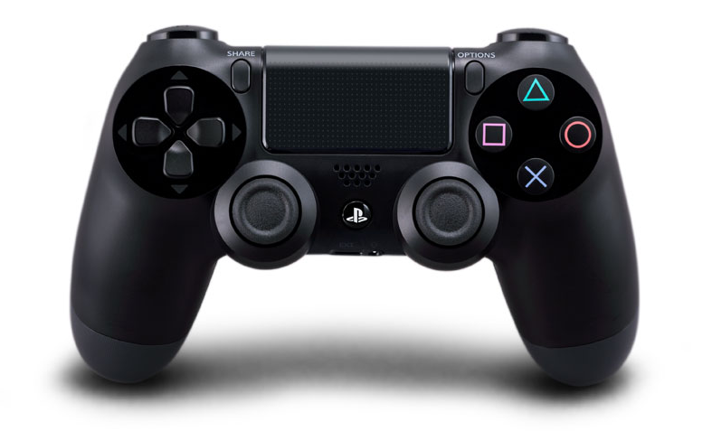
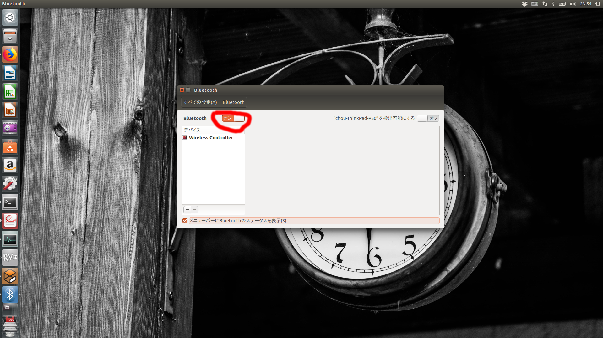
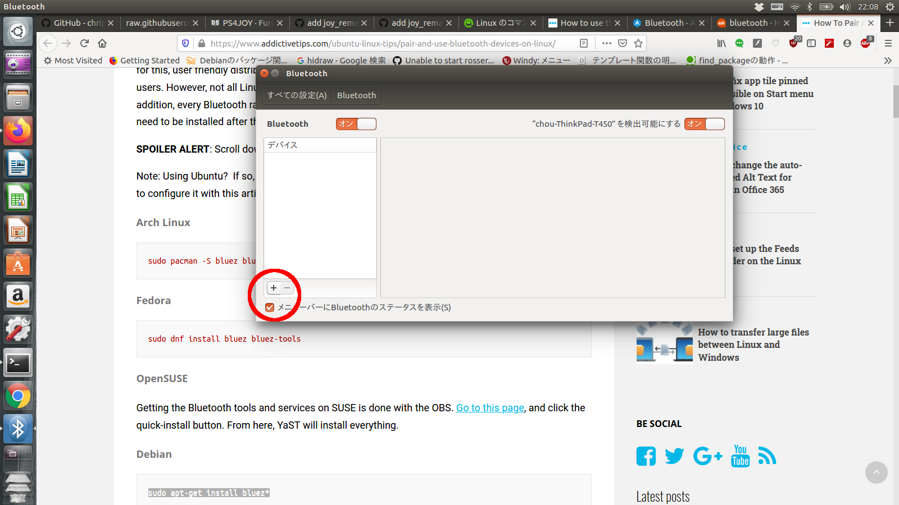
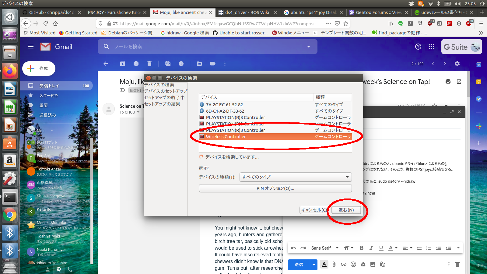

## PlayStation DualShock4


### Install ds4drv
Please refer to https://github.com/chrippa/ds4drv 
```
$ sudo pip install ds4drv
```
### Bluetooth Pairing
**Note**: no need to connect the controller with host PC via USB cable 

<details><summary>instruction</summary><div>

1. Please check the Bluetooth is ON in host PC:

2. Click **+** button:

3. Hold **Share** + **PS button** until the LED starts blinking rapidly, then a new device **Wireless Controller** will appear. Select this new device and click "Next". Finally, this device will be paired successfully in Ubuntu:

   the controller's LED will turn in blue and  you can also find `/dev/input/js0` which is created by Bluetooth driver (**not** from ds4drv).
4. Disconnect this device by holding only **PS button** until the LED turns off (more than 10 seconds). 
5. run following command:

```
$ sudo ds4drv --hidraw 
[info][controller 1] Created devices /dev/input/js0 (joystick) /dev/input/event1 (evdev) 
[info][hidraw] Scanning for devices
m[info][controller 1] Connected to Bluetooth Controller (1C:66:6D:7B:C6:0A hidraw0)
[info][hidraw] Scanning for devices
[info][controller 1] Battery: Fully charged
[warning][controller 1] Signal strength is low (18 reports/s)
```

**Note**: important point is that the bluetooth devices should be linked to `/dev/input/js0` by the above command. If not, please do step 4 again.

6. hold only **PS button** for a while, then the LED will turn back to blue again, meaning successful connection. The Bluetooth icon will have the padlock emblem. 

7. disable touchpad input device by creating `/etc/udev/rules.d/50-ps4joy.rules` which contains following content:
```
SUBSYSTEM=="input", ATTRS{name}=="*Wireless Controller Touchpad", RUN+="/bin/rm %E{DEVNAME}", ENV{ID_INPUT_JOYSTICK}=""
``` 
**Note**: please refer to `2.1 disable touchpad input device` in http://wiki.ros.org/ds4_driver for more details.

8. restart udev rule by following commands:
```
$ sudo udevadm control --reload-rules
$ sudo udevadm trigger
```

</div></details>
 

### Start sixad on boots (**非推奨**)
Please check the instruction of "PS4JOYドライバの自動起動設定" in [this blog](https://furushchev.ru/kb/2-HACKS/2-PS4JOY.html)

### Common commands:
#### the different key bounds of dualshock4 are:
- `options` in dualshock4 = `start` in dualshock3
- `share` in dualshock4 = `select` in dualshock3

#### different commands:

| command  | action |
|:-:|:-:|
| `options`| motor arming (please do this before takeoff)|
| `share` (short push) | force landing (without xy position control, robot will descend slowly)|
| `share` (long push, > 2.0s) | halt (i.e. stop motor immediately )|
| `cross-left + circle` | takeoff (this can be received by robot only after motor arming)|
| `cross-right + square`| landing|
| `select` (short push) | force landing (without xy position control, robot will descend slowly)|
| `select` (long push, > 2.0s) | halt (i.e. stop motor immediately )|
| `triangle` | xy(horizontal) velocity control mode|
| `cross(X)` | xy(horizontal) position control mode|
| `cross-down`| xy(horizontal) attitude control mode|
| `left stick vertical`| movement in world x axis (only available in velocity/attitude control mode)|
| `left stick horizontal`| movement in world y axis (only available in velocity/attitude control mode)|
| `left stick vertical` + `L2`| movement in baselink (local) x axis (only available in velocity/attitude control mode)|
| `left stick horizontal` + `L2`| movement in baselink (local) y axis (only available in velocity/attitude control mode) |
| `right stick vertical`| movement in z axis |
| `right stick horizontal` + push `right stick`| movement in yaw axis |

For more information about ps4joy in ros, please check [here](http://cryborg.hatenablog.com/entry/2016/09/19/185501)
