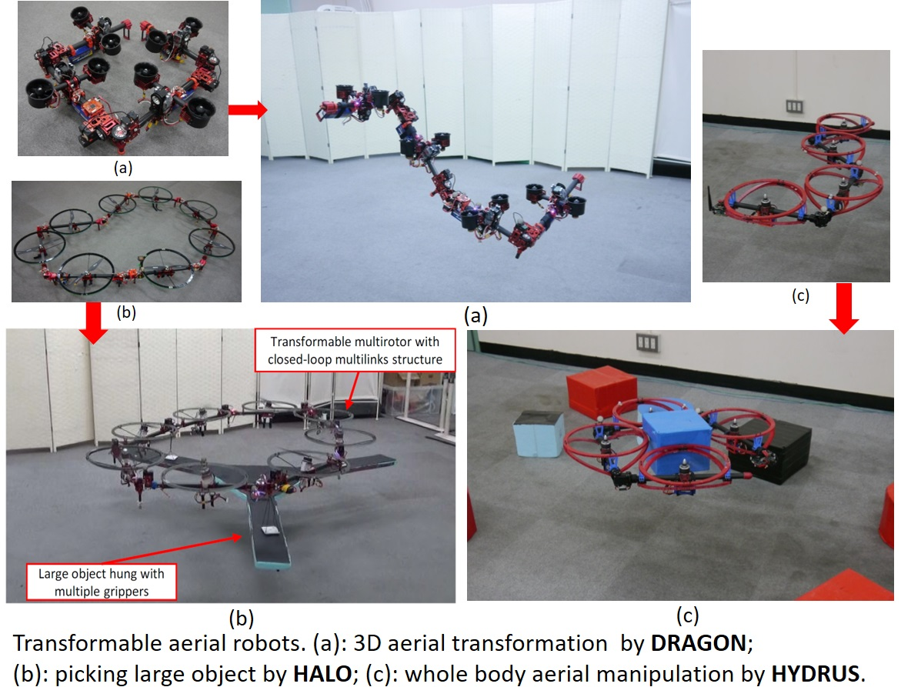

[](https://travis-ci.com/jsk-ros-pkg/jsk_aerial_robot)

# This is for aerial robot, especially for transformable aerial robot as shown in following figure.



## Setup

```bash
source /opt/ros/${ROS_DISTRO}/setup.bash # please replace ${ROS_DISTRO} with your specific env variable, e.g., melodic
mkdir -p ~/ros/jsk_aerial_robot_ws/src
cd ~/ros/jsk_aerial_robot_ws
sudo rosdep init
rosdep update
wstool init src
wstool set -u -t src jsk_aerial_robot http://github.com/jsk-ros-pkg/jsk_aerial_robot --git
wstool merge -t src src/jsk_aerial_robot/aerial_robot_${ROS_DISTRO}.rosinstall
wstool update -t src
rosdep install -y -r --from-paths src --ignore-src --rosdistro $ROS_DISTRO
catkin build
```

## Demo
Please check instruction in [wiki](https://github.com/JSKAerialRobot/aerial_robot/wiki).
