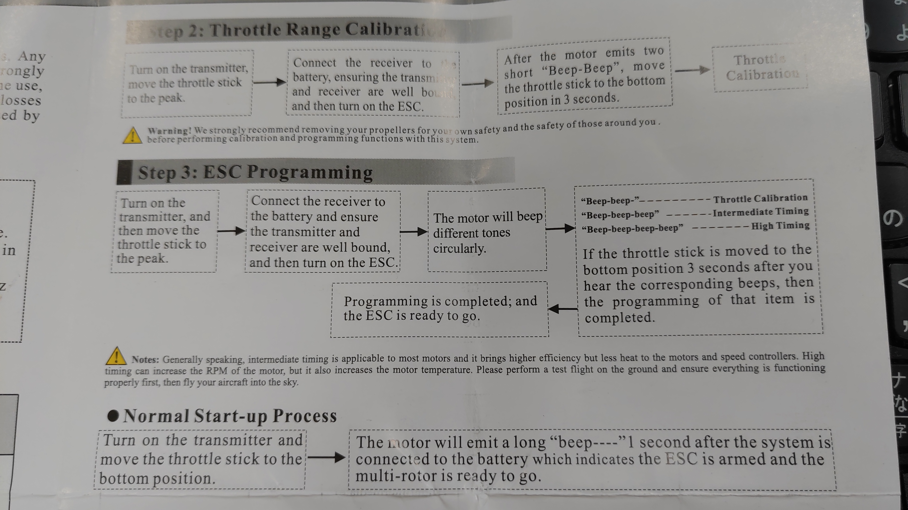

## joint and gimbal servo motor
### dynamixel
you can use [dynamixel_wizard2](http://emanual.robotis.com/docs/en/software/dynamixel/dynamixel_wizard2/) to set the configuration from ubuntu/windows.

#### motor types:

* mx28AR \
**protocol**: http://support.robotis.com/jp/product/dynamixel/mx_series/mx-28at_ar.htm 
* xh430 \
**protocol**: http://support.robotis.com/en/product/actuator/dynamixel_x/xh_series/xh430-w210_main.htm 

#### general configuration:
- `baud rate: 3` (i.e., 1Mbps)
- `return delay time: 25[ms]`
- `operating mode: 5`

#### id setting
slave_id of each neuron is incremented from 1 and set via rqt.  
ID of servo motors connected to the same neuron is incremented from 1 for joints and gimbals, in that order.  
The value of each ID in the Servo.yaml is incremented from 0 starting from the servo with ID 1 connected to neuron with slave_id 1.

Example

|slave_id of neuron|1|1|1|2|2|2|2|3|3|3|  
|ID of dynamixel|1 (joint)|2 (gimbal)|3 (gimbal)|1 (joint)|2 (joint)|3 (gimbal)|4 (gimbal)|1 (joint)|2 (joint)|3 (gimbal)|  
|id in Servo.yaml|0|1|2|3|4|5|6|7|8|9|

## thrust rotor 
- motor specification measurement: See [here](https://github.com/tongtybj/aerial_robot/blob/master/aerial_robot_nerve/motor_test/README.md)

### ESC calibration

- `roslaunch spinal_ros_bridge serial.launch`
- Every time restart spinal, remember to publish topic to /uav_info, HydrusX example:
`rostopic pub -1 /uav_info spinal/UavInfo "motor_num: 4 uav_model: 16 baselink: 2"`
1. remove all the propeller for safety, unplugin all the ESC from power cable for safety
2. publish topic with pwm maximum value **(ESC NOT CONNECT TO Power Cable, DANGEROUS!!)**\
`rostopic pub -1 /pwm_test std_msgs/Float32 "data: 0.95"` (0.95 means 1900)
3. connect one ESC to respective power cable

4. wait for the voice info (as picture) and publish topic with pwm minimum value
'rostopic pub -1 /pwm_test std_msgs/Float32 "data: 0.5"' (0.5 means 1000)
5. unplugin the ESC from power cable, and start to calibrate next ESC \
- If want to test calibration results, plugin ESC and publish topic with low pwm value: \
	`rostopic pub -1 /pwm_test std_msgs/Float32 "data: 0.53"` (0.53 means 1060)
6. repeat the process 1-5 but wait for the voice info of High Timing, to change to High Timing mode
