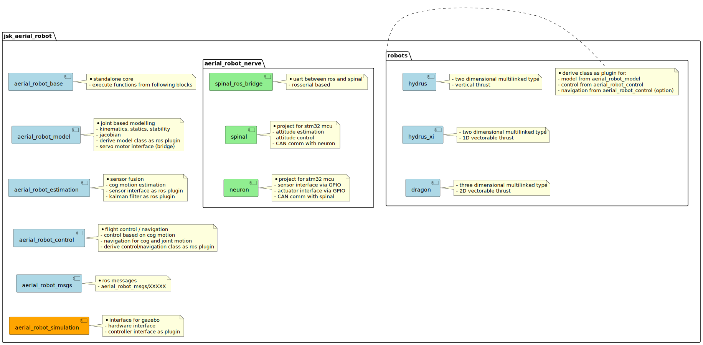
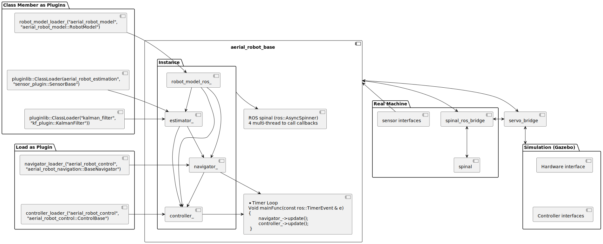
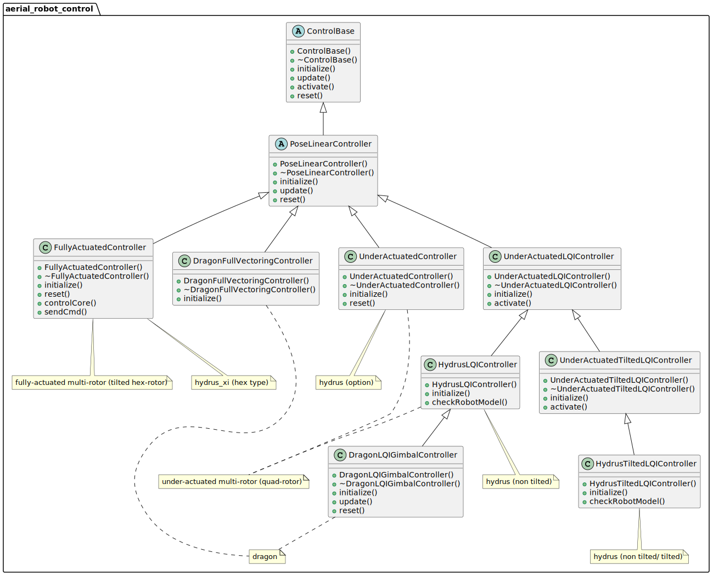

# About Our System

## Folder Structure

## System Config

## Class Diagram

## Workflow

## File Structure

### ./aerial_robot

A ROS Package. A sum-up of all the packages in this repository.

### ./aerial_robot_base

A ROS Package. Aerial robot base class. It contains:
- bin: some bash commands
- config: parameters for sensors, including altimeter, gps, imu, and mocap. Stored in .yaml files.
- include: header files for the aerial_robot_base class.
- launch: launch files for some common functions, including joy_stick, mocap, and rtk_gps.
- scripts: python files for some common functions, including controlling the robot with a keyboard and calculating RMS error.
- src: source files for the aerial_robot_base class, loading plugins for robot_model, estimator, navigator and controller.
  Define a main loop with main_rate and update navigator and controller subsequently.
- test: files for rostest, only hovering test.

### ./aerial_robot_control

A ROS Package with various plugins for control. It contains:
- cfg: python files for dynamic reconfigure, a tool to change parameters online. Include PID and LQI controllers.
- include: header files for the controller.
- plugins: controller plugins, including FullyActuatedController, UnderActuatedController, UnderActuatedLQIController,
  and UnderActuatedTiltedLQIController. User can select one of them through parameters, which generally stored in FlightControl.yaml.
- scripts: python demo to test controller.
- src: source files for the controllers.

### ./aerial_robot_estimation

A ROS package with various plugins for sensor usage and state estimation. It contains:
- cfg: python files for dynamic reconfigure, including Kalman Filter.
- config: parameters for optical flow.
- include: header files for the estimator.
- launch: launch files for the optical flow.
- plugins: estimator plugins, including kf_plugins (choosing sensor fusion method), sensor_plugins (choosing sensors),
  and and vision_nodelet. Parameters are generally stored in StateEstimation.yaml.
- src: source files for the estimator: kalman filter for sensor fusion, different sensors, and vision (optical flow only).
  Sensors include altitude, gps, imu, mocap, plane_detection and visual odometry (VO).

### ./aerial_robot_model

A ROS package with various plugins for robot model, calculating kinematics from urdf parameters with KDL and publishing
tf info. It contains:
- include: header files for the robot model.
- launch: launch files for setting robot_description to rosparameter server, publishing joint state and tf info, and
  visualizing the robot in rviz.
- nodes: don't know yet. Maybe lisp file?
- plugins: include multirotor_robot_model and underactuated_tilted_robot_model.
- script: a python file that converts cog and intertia parameters from 3D models.
- src: source files for computing kinematics automatically, communicating with servos, and publishing tf info.
- srv: a service for adding a new link to the robot model.
- test: test by comparing jacobians calculated by KDL and numerical method.

### ./aerial_robot_msgs

A ROS package defining message types for aerial robot, containing: state-based info, parameter-based info.

### ./aerial_robot_nerve

Program for low-level autopilot running on a STM32 MCU. Leverage STM32CubeMX to generate the code and rosserial to communicate
with ROS.

### ./aerial_robot_simulation

A ROS package with various plugins for simulation in Gazebo, simulating dynamics, sensor noise, and controller in the nerve module. It contains:
- config: parameters for simulation, including the parameters to simulating MoCap. Stored in .yaml files.
- gazebo_model: world files.
- include: header files for the simulation.
- launch: launch files for Gazebo-based simulation.
- scripts: gazebo_control_bridge.py
- src: source files for the simulation, including dynamics, sensor noise, and controller in the nerve module.
- xacro: sensor setting for spinal MCU

### ./images

Store images.

### ./robots

Include multiple ROS Packages. Each package is for one specific robot. Take mini_quadrotor as an example, it contains:
- config: the yaml files for the robot, including various parameters for the robot, such as the parameters for the
  motors, controllers, rviz, simulation, and so on.
- launch: the launch files for the robot. Note that for each robot, there is a bringup.launch file in the launch
  folder. The bringup.launch file will load parameters and launch other launch files, including motor, battery, state
  fusion, control, navigation, and so on.
- test: files for rostest. Hovering test included.
- urdf: the urdf files for the robot, including the dae files (shape and inertial) for main_body, propeller, and a
  battery. Based on these urdf files, the kinematic parameters of the whole body will be calculated through Kinematics
  and Dynamics Library (KDL). The urdf files are also used for visualization in rviz and Gazebo.
