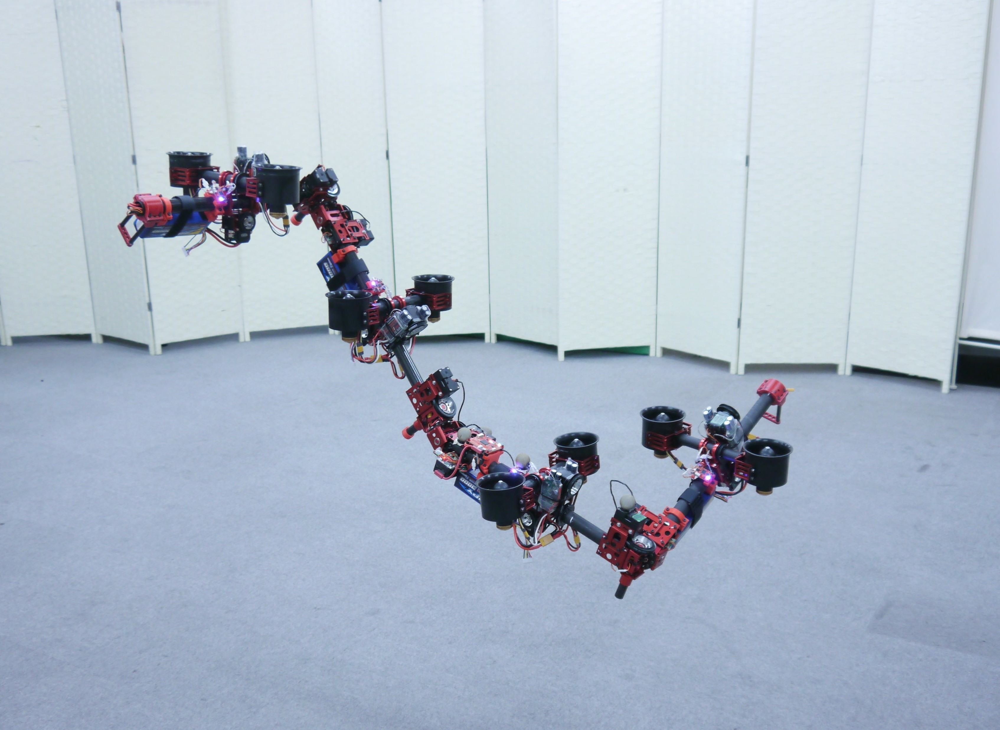

# DRAGON: 

**Definition**: A **D**ual-**R**otor-Embedded Multilink Robot With the **A**bility of Multi-De**g**ree-of-Freedom Aerial Transformati**on** 

 <a href="https://www.youtube.com/embed/ZDYU22qNI_Q" target="_blank"></a>

**Related Papers**:
-  M. Zhao, T. Anzai, F. Shi, X. Chen, K. Okada and M. Inaba, "Design, Modeling, and Control of an Aerial Robot DRAGON: A Dual-Rotor-Embedded Multilink Robot With the Ability of Multi-Degree-of-Freedom Aerial Transformation" in IEEE Robotics and Automation Letters, vol. 3, no. 2, pp. 1176-1183, April 2018.

# How to run:

## 0. Calibration & Sourcing: 

   - Calibration is via rosserial between on-board processor and spinal. Please check the wiki.
   - Source the workspace with ``` $ source /path/to/ws/devel/setup.bash ```

## 1. Robot bringup command:

   - **Real machine**: ``` $ roslaunch dragon bringup.launch ```
         
     **Note**: please check the servo angles before takeoff. use  `$ rostopic echo -c /servo/states` to check whether any angle exceeds the normal value (e.g. 5 -> 4095).

   - **Simulation**: ``` $ roslaunch dragon bringup.launch real_machine:=false simulation:=true headless:=false ```

## 2. Teleoperation
   **Note**: after the robot completely transforms to normal form

   - **keyboard**: please check instruction [wiki](https://github.com/JSKAerialRobot/aerial_robot/wiki/keyboard_operation)
   - **joystick**: please check instruction [wiki](https://github.com/JSKAerialRobot/aerial_robot/wiki/joystick_operation)
   
## 3. Transformation demonstration
   **Note**: after the robot completely hovering with the message `Hovering!`
   
   - defualt dragon pose: ``` $ rosrun dragon transformation_demo.py  _mode:=0```
   - spiral pose: ``` $ rosrun dragon transformation_demo.py  _mode:=1```
   - m-like pose: ``` $ rosrun dragon transformation_demo.py  _mode:=2```
   - normal pose: ``` $ rosrun dragon transformation_demo.py  _reset:=1```
   - reverse normal pose: ``` $ rosrun dragon transformation_demo.py  _reverse_reset:=1```
