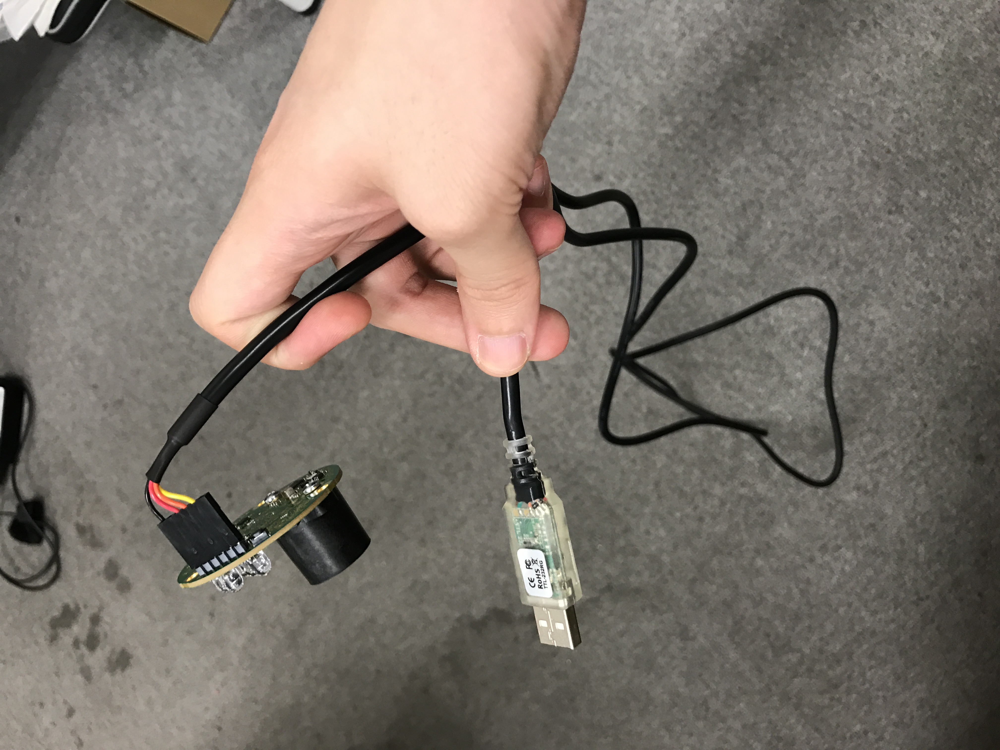
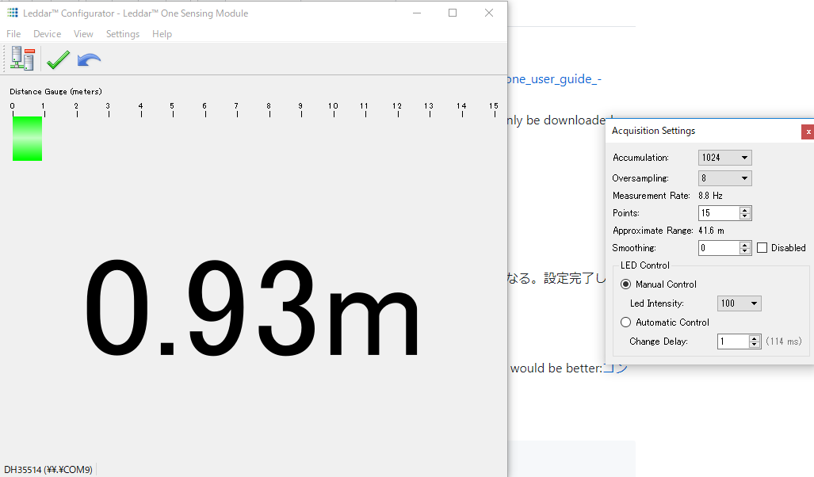
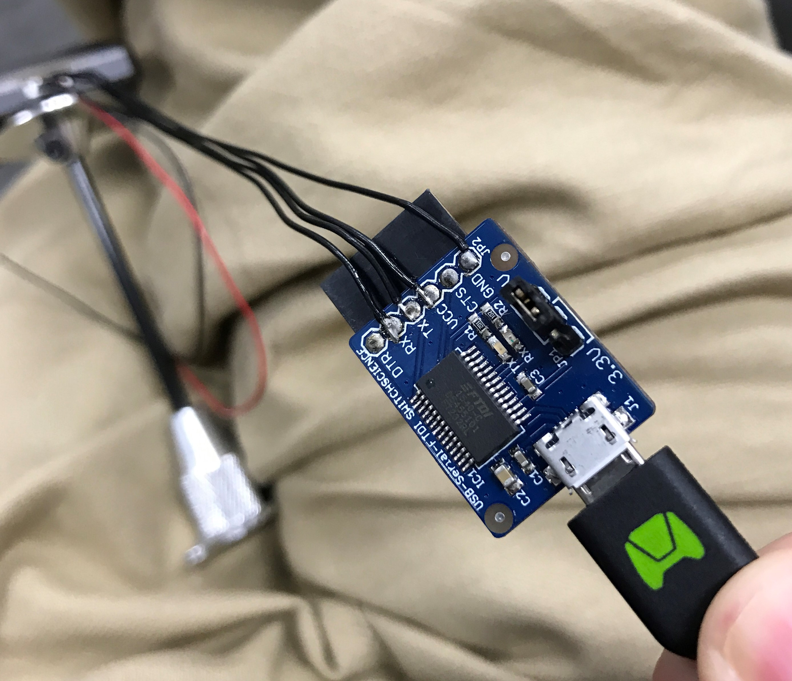
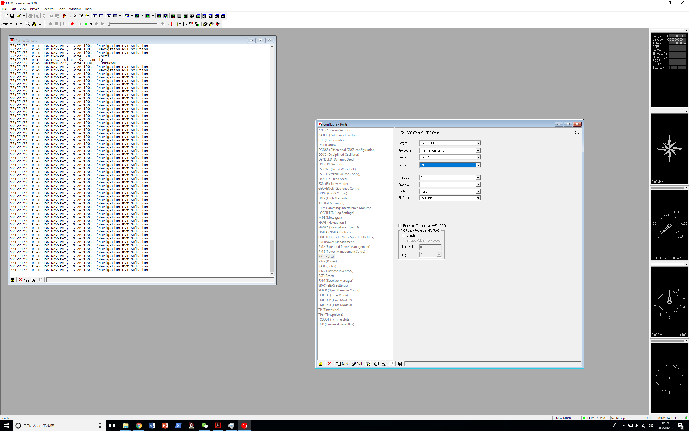
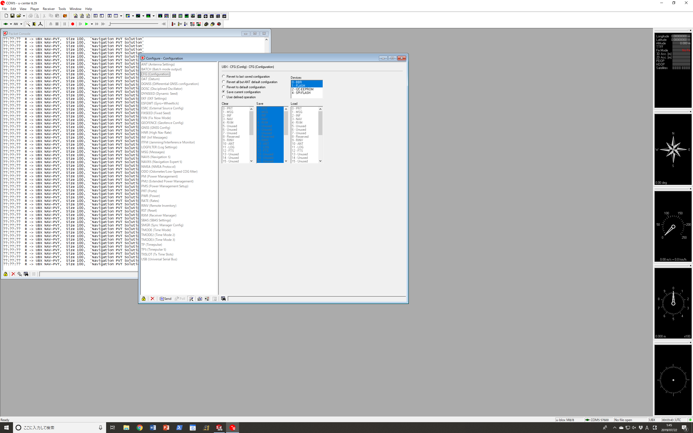

### General udev setting:
1. Execute `$ sudo udevadm info -a /dev/ttyUSBX` to get information of your device. X is your device's number. An example is following:
  
<details><summary>example</summary><div>

```
$ sudo udevadm info -a /dev/ttyUSB0
Udevadm info starts with the device specified by the devpath and then
walks up the chain of parent devices. It prints for every device
found, all possible attributes in the udev rules key format.
A rule to match, can be composed by the attributes of the device
and the attributes from one single parent device.

  looking at device '/devices/3610000.xhci/usb1/1-4/1-4:1.0/ttyUSB0/tty/ttyUSB0':
    KERNEL=="ttyUSB0"
    SUBSYSTEM=="tty"
    DRIVER==""

  looking at parent device '/devices/3610000.xhci/usb1/1-4/1-4:1.0/ttyUSB0':
    KERNELS=="ttyUSB0"
    SUBSYSTEMS=="usb-serial"
    DRIVERS=="ftdi_sio"
    ATTRS{latency_timer}=="1"
    ATTRS{port_number}=="0"

  looking at parent device '/devices/3610000.xhci/usb1/1-4/1-4:1.0':
    KERNELS=="1-4:1.0"
    SUBSYSTEMS=="usb"
    DRIVERS=="ftdi_sio"
    ATTRS{authorized}=="1"
    ATTRS{bAlternateSetting}==" 0"
    ATTRS{bInterfaceClass}=="ff"
    ATTRS{bInterfaceNumber}=="00"
    ATTRS{bInterfaceProtocol}=="ff"
    ATTRS{bInterfaceSubClass}=="ff"
    ATTRS{bNumEndpoints}=="02"
    ATTRS{interface}=="FT232R USB UART"
    ATTRS{supports_autosuspend}=="1"

  looking at parent device '/devices/3610000.xhci/usb1/1-4':
    KERNELS=="1-4"
    SUBSYSTEMS=="usb"
    DRIVERS=="usb"
    ATTRS{authorized}=="1"
    ATTRS{avoid_reset_quirk}=="0"
    ATTRS{bConfigurationValue}=="1"
    ATTRS{bDeviceClass}=="00"
    ATTRS{bDeviceProtocol}=="00"
    ATTRS{bDeviceSubClass}=="00"
    ATTRS{bMaxPacketSize0}=="8"
    ATTRS{bMaxPower}=="90mA"
    ATTRS{bNumConfigurations}=="1"
    ATTRS{bNumInterfaces}==" 1"
    ATTRS{bcdDevice}=="0600"
    ATTRS{bmAttributes}=="a0"
    ATTRS{busnum}=="1"
    ATTRS{configuration}==""
    ATTRS{devnum}=="5"
    ATTRS{devpath}=="4"
    ATTRS{idProduct}=="6001"
    ATTRS{idVendor}=="0403"
    ATTRS{ltm_capable}=="no"
    ATTRS{manufacturer}=="FTDI"
    ATTRS{maxchild}=="0"
    ATTRS{product}=="FT232R USB UART"
    ATTRS{quirks}=="0x0"
    ATTRS{removable}=="unknown"
    ATTRS{serial}=="A907HR6F"
    ATTRS{speed}=="12"
    ATTRS{urbnum}=="24761"
    ATTRS{version}==" 2.00"

  looking at parent device '/devices/3610000.xhci/usb1':
    KERNELS=="usb1"
    SUBSYSTEMS=="usb"
    DRIVERS=="usb"
    ATTRS{authorized}=="1"
    ATTRS{authorized_default}=="1"
    ATTRS{avoid_reset_quirk}=="0"
    ATTRS{bConfigurationValue}=="1"
    ATTRS{bDeviceClass}=="09"
    ATTRS{bDeviceProtocol}=="01"
    ATTRS{bDeviceSubClass}=="00"
    ATTRS{bMaxPacketSize0}=="64"
    ATTRS{bMaxPower}=="0mA"
    ATTRS{bNumConfigurations}=="1"
    ATTRS{bNumInterfaces}==" 1"
    ATTRS{bcdDevice}=="0409"
    ATTRS{bmAttributes}=="e0"
    ATTRS{busnum}=="1"
    ATTRS{configuration}==""
    ATTRS{devnum}=="1"
    ATTRS{devpath}=="0"
    ATTRS{idProduct}=="0002"
    ATTRS{idVendor}=="1d6b"
    ATTRS{interface_authorized_default}=="1"
    ATTRS{ltm_capable}=="no"
    ATTRS{manufacturer}=="Linux 4.9.108-tegra xhci-hcd"
    ATTRS{maxchild}=="4"
    ATTRS{product}=="xHCI Host Controller"
    ATTRS{quirks}=="0x0"
    ATTRS{removable}=="unknown"
    ATTRS{serial}=="3610000.xhci"
    ATTRS{speed}=="480"
    ATTRS{urbnum}=="73"
    ATTRS{version}==" 2.00"

  looking at parent device '/devices/3610000.xhci':
    KERNELS=="3610000.xhci"
    SUBSYSTEMS=="platform"
    DRIVERS=="tegra-xusb"
    ATTRS{driver_override}=="(null)"
    ATTRS{hsic_power}=="0"
```

</div></details>


2. Create `99-aerial-robot-dev.rules` at `/etc/udev/rules.d/` as follows:
```
KERNEL=="ttyUSB*",  ATTRS{idVendor}=="0403", ATTRS{idProduct}=="6001", ATTRS{serial}=="A907HR6F", SYMLINK+="flight_controller"
ACTION=="add", SUBSYSTEM=="usb-serial", DRIVER=="ftdi_sio", ATTR{latency_timer}="1"
```
The numbers of `idVendor`, `idProduct` and `serial` should be modified correctly referring to the result of 1.

Then reload udev rules: 
```
$ sudo udevadm control --reload-rules && udevadm trigger
```
Finally, replug your device

3. If you don't have permission to use `/dev/ttyUSB*`, do

   `$ sudo adduser [username] dialout`

------------

### LeddarOne 
- **Product**： https://www.robotshop.com/media/files/pdf2/rb-led-02-04_-_54a0025-2_leddar_one_user_guide_-_2016-09-01.pdf
- **Pin assignment**: `GND(1), IRQ, Supply(5V), Rx, Tx, Reset`
- **Download**: 
     - installer: `LeddarOneInstaller`
     - download from website: https://support.leddartech.com/ (please registration first)  
     - or you can download the installer from andromeda: `\\andromeda\share1\aerial_robot\software`

- **Change configuration**:

<details><summary>instruction</summary><div>

   1. Use following uart-usb cable to connect with sensor module:
         
   2.  configuration mode: `Device\Configuration\Acquisition`:
         
   3.  `Accumulation`: 256
   4.  `Oversmapling`: 8
   5.  `Measurement Rate`: 35.2Hz
   6.  Click the `green ✔` to apply the change.

</div></details>

- **Connection examples**:

<details><summary>examples</summary><div>

   1. Jetson TX2 Orbitty Carrier
      - pinout assignment: please check  P.11 of [this datasheet](http://connecttech.com/pdf/CTIM-ASG003_Manual.pdf)
      - connection: please use UART1 `2,5,6,20`.  Leadderone -> PC:  1->(GND, black)->20, 3->(5V,red)->2, 4->(Rx,orange, Tx)->5, 5->(Tx,yellow,Rx)->6
      - create the symbolic link to `leddarone` by adding following to `/etc/udev/rules.d/99-aerial-robot-dev.rules`:
         ```
         KERNEL=="ttyUSB*", SYMLINK+="leddarone"
         ```
   2. Intel upbaord
      - pinout assignment: please check [this datasheet](https://software.intel.com/en-us/articles/robotics-development-kit-blink-led-tutorial) and [this image](images/leddarone_upboard_connection.jpg)
      - create the symbolic link to `leddarone` by adding following to `/etc/udev/rules.d/99-aerial-robot-dev.rules`:
        ```
        KERNEL=="ttyS4", SYMLINK+="leddarone"
        ```
        **note**: two case for upboard: `/dev/ttyS1` or `/dev/ttyS4`. For new one, `/dev/ttyS4` is major:https://forum.up-community.org/discussion/3623/upboard-uart-error-initializing-uart
</div></details>


-------------------

### GPS
- **Product**:  [UBLOX M8N GPS-Compass Module](https://hobbyking.com/jp_jp/ublox-micro-m8n-gps-compass-module-1pc.html)
- **Core Chip**: [blox NEO-M8N series](https://www.u-blox.com/ja/product/neo-m8-series)
- **Pin assignment**: `I2C SLC(RED,COMPASS), I2C SDA(COMPASS), VCC (5V) RX, TX, GNG`
- **Download**: 
     - installer: `u-center`
     - download from website: https://www.u-blox.com/ja/product/u-center-windows
     - or you can download the installer from andromeda: `\\andromeda\share1\aerial_robot\software`

- **Change configuration**:

<details><summary>instruction</summary><div>

   1. Use following uart-usb cable to connect with sensor module:
       
   2. **note**: please click `send` to apply the change every time:
   3. Rates: 
        - Time Source: `1-GPS time`
        - Measurement Period: `100[ms]`(**important!**)
       
   4. UBX-CFG(Config)-MSG(Messages)
        - Message: `01-07 NAV-PVT` 
          UART1:   check `☑`(i.e., 1)
        - Message: `01-06 NAV-SOL`
          UART1:   uncheck `☑`(i.e., 0)
       
   5. UBX-CFG(Config)-PRT(Ports)
        - Baudrate: `19200`
       
   6. UBX-CFG(Config)-CFG(Configuration)
        - Check `Save current configuration` and Click `Send`
       

</div></details>

---------------------

### Magnetometer

- **magnetic declination**:

   - rqt: https://github.com/tongtybj/aerial_robot/pull/395
   - search declination in different location: https://www.magnetic-declination.com/Japan/Tokyo/1348515.html
   - tokyo: -0.1335 rad (-7.65 deg)

----------------------

### ZED stereo camera

#### how to reset the visual odometry during flight:

execute following commands in order:
```
$ rosservice call /zed/reset_tracking "{}"
$ rosservice call /zed/reset_odometry "{}" 
```
------------------------

### Realsense

#### For X86_64 (e.g. upboard), you have to setup the udev:

- https://github.com/IntelRealSense/librealsense/blob/master/scripts/setup_udev_rules.sh
- `$ git clone https://github.com/IntelRealSense/librealsense.git`
- `$ cd librealsense & ./scripts/setup_udev_rules.sh`

#### For Nvidia Jetson TX2:

- Please refer to [here](https://github.com/atinfinity/lab/wiki/librealsense-sdk-install-jetsontx2#%E6%9C%80%E6%96%B0%E7%89%88cmake%E3%82%A4%E3%83%B3%E3%82%B9%E3%83%88%E3%83%BC%E3%83%AB).

#### Basic command for different sensors:

- realsense t265:
  ```
  $ roslaunch realsense2_camera rs_t265.launch
  ```
- realsense d435/d435i:
  
  ```
  $ roslaunch  aerial_robot_perceptionrealsence.launch enable_pointcloud:=true aligh_depth:=false depth_registered_processing:=true alighn_depth:=true
  ```

- Plane detect:

  ```
  $ roslaunch aerial_robot_perception　hydrus_ceil_detect_real.launch nodelet_manager_name:=/camera/realsense2_camera_manager launch_manager:=false cloud_input:=/camera/depth_registered/points camera_info:=/camera/depth/camera_info
  ```
